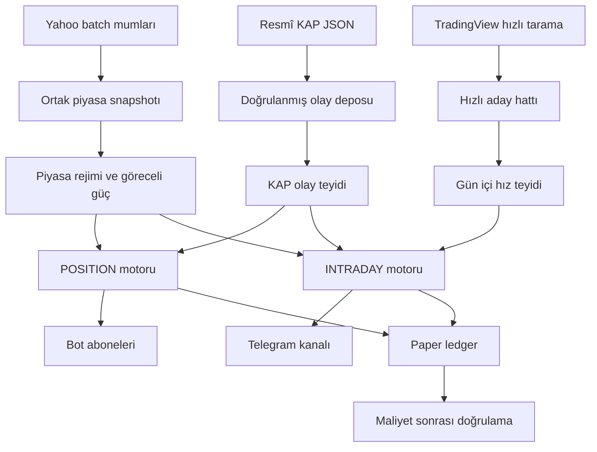

# BIST Profesyonel Trade Mimarisi ve Sinyal Ayrımı

**Tarih:** 27 Eylül 2026  
**Kapsam:** Yalnız `muratarslan35/bisthissetarayici-v2`  
**Veri politikası:** Ücretsiz veri; Yahoo batch mumları, TradingView hızlı tarayıcı verisi ve resmî KAP verisi  
**İzolasyon:** IMS repo, sunucu, servis, veritabanı ve deploy akışı kapsam dışıdır ve değiştirilmez.

## 1. Mimari hedef

Sistem bir fiyat tahmin makinesi değil, iki farklı işlem ufku için aday seçen ve sonuçlarını maliyet sonrası ölçen bir karar destek platformudur:

1. **POSITION:** 2–10 işlem günlük hareketler, bireysel bot abonelerine gönderilir.
2. **INTRADAY:** Aynı seans içindeki hızlı hareketler, Telegram kanalına gönderilir.

İki akış aynı piyasa verisini paylaşabilir; ancak sinyal koşulları, risk süresi, kapanış zamanı, skor eşiği ve hedef kitlesi kesinlikle birbirinden ayrıdır.

## 2. Veri akışı

## 3. Ücretsiz veri kullanım kuralları

- Yahoo verisi yalnız merkezi batch çağrıyla alınır; indikatör başına ağ isteği yapılmaz.
- Intraday ve günlük veriler ayrı TTL ile cache edilir.
- Hata halinde exponential backoff uygulanır; agresif tekrar çağrı yapılmaz.
- TradingView hızlı hattı yalnız güçlü/likit adayları takip eder; tüm ağır yapısal göstergeleri hızlı quote üzerinden yeniden üretmez.
- KAP olayı yalnız resmî liste API'sinde görüldüğünde kabul edilir ve bildirim kimliğiyle tekilleştirilir.
- Ücretsiz veri bid/ask ve order book sağlamadığı için bunlar varmış gibi gösterilmez; bunun yerine muhafazakâr maliyet tahmini uygulanır.

## 4. Ortak piyasa filtresi

Her iki motor da şu ortak kontrollerden geçer:

- veri güveni ve veri yaşı,
- minimum günlük TL hacmi,
- BIST fiyat limitine yaklaşmış geç giriş filtresi,
- piyasa rejimi ve breadth,
- BIST evreni içindeki göreceli güç yüzdeliği,
- RSI'ın tek başına sinyal üretmemesi,
- aynı sembol/strateji için cooldown ve state transition,
- gerçek mum hacmi; uygulama polling sayısından sahte RVOL üretilmemesi.

## 5. Bot sinyalleri — POSITION

| Özellik | Kural |
|---|---|
| Hedef | 2–10 işlem günlük swing hareketi |
| Alıcı | Aktif bireysel Telegram bot aboneleri |
| Ana zaman dilimleri | Günlük + 4 saat + 1 saat |
| Stratejiler | `KOMBINE_V3`, `SUPER_KOMBINE_V3`, `TREND_START_V3`, `KAP_POSITION_V3` |
| Minimum yayın skoru | Varsayılan 77 |
| Likidite | 20 günlük ortalama TL hacim filtresi |
| Risk | Günlük ATR ve yapısal destek; yaklaşık %2,5–%6,5 risk bandı |
| Hedefler | 1,5R / 3R / 5R |
| Süre sonu | 14 takvim günü; yaklaşık 2–10 işlem gününü kapsar |
| Kapanış bildirimi | Bot abonelerine |

### POSITION algoritmaları

- `KOMBINE_V3`: yerleşmiş günlük/4H trend içinde kontrollü geri çekilme ve yeniden hızlanma.
- `SUPER_KOMBINE_V3`: günlük yapısal kırılım, göreceli güç ve hacim teyidi.
- `TREND_START_V3`: EMA50/EMA200 yapısı tamamen olgunlaşmadan erken trend başlangıcı.
- `KAP_POSITION_V3`: taze ve doğrulanmış KAP olayı + günlük/4H trend teyidi.

### 4H champion/challenger takibi

`TREND_START_V3` için yeni adaptif 4H puanı çalışmaya devam eder. Her sinyal ayrıca:

- `CHAMPION_AND_CHALLENGER`: eski katı 4H koşulunu da geçiyor,
- `CHALLENGER_ONLY`: yalnız yeni adaptif puanla geçiyor

etiketiyle saklanır. Böylece erken sinyal gevşetmesinin gerçekten net expectancy artırıp artırmadığı canlı paper sonuçlarla ölçülebilir.

## 6. Kanal sinyalleri — INTRADAY

| Özellik | Kural |
|---|---|
| Hedef | Aynı seans içindeki momentum hareketi |
| Alıcı | Telegram yayın kanalı |
| Ana zaman dilimleri | 15 dakika + 1 saat + 4 saat yapısal teyit |
| Hız katmanı | 15/30/60 saniye fiyat ivmesi ve gerçek hacim/RVOL |
| Stratejiler | `MOMENTUM_IGNITION_V3`, `INTRADAY_MOMENTUM_V3`, `EARLY_IGNITION_V3`, `KAP_EVENT_INTRADAY_V3`, `KAP_EARLY_IGNITION_V3` |
| Minimum yayın skoru | Varsayılan 82 |
| Risk | 15 dakikalık ATR ve intraday yapı; yaklaşık %1,8–%3,5 risk bandı |
| Hedefler | 1,2R / 2,5R / 4R |
| Süre sonu | Aynı gün 17:50 |
| Kapanış bildirimi | Telegram kanalına |

Hızlı fiyat yalnız giriş zamanlamasını teyit eder. Günlük trend, likidite, ATR, VWAP, göreceli güç ve piyasa rejimi kontrollerini atlayamaz.

## 7. Kesin yönlendirme sözleşmesi

| `signal_scope` | Hedef | İzin verilen ufuk |
|---|---|---|
| `POSITION` | `BOT_SUBSCRIBERS` | 2–10 işlem günü |
| `INTRADAY` | `TELEGRAM_CHANNEL` | Aynı işlem günü |
| Diğer/bilinmeyen | Gönderim reddedilir | Yok |

Yönlendirme `signal_routing.py` içindeki tek sözleşmeden yapılır. Kodun farklı noktalarında scope metinleriyle bağımsız karar verilmez. Bilinmeyen scope güvenli biçimde hata üretir ve hiçbir hedefe gönderilmez.

## 8. Profesyonel paper execution modeli

Eski ölçüm son görülen fiyatı sürtünmesiz fill kabul ediyordu. Yeni `FREE_DATA_EXECUTION_V1` modeli her iki tarafta şu maliyetleri tahmin eder:

- komisyon,
- spread'in yarısı,
- temel slippage,
- sinyal–yayın gecikmesi,
- likidite cezası,
- ATR/volatilite cezası,
- eski veri cezası,
- gün içi işlemler için ek hızlı yürütme cezası.

Alış fiyatı yukarı, satış fiyatı aşağı yönde ilgili fiyat adımına yuvarlanır. Ledger hem ekrandaki ham giriş/çıkışı hem de modellenmiş giriş/çıkışı saklar:

- `gross_result_pct`: ham fiyat sonucu,
- `net_result_pct`: tahmini maliyet sonrası sonuç,
- `modeled_entry_price` / `modeled_exit_price`,
- giriş/çıkış maliyet baz puanı,
- execution model sürümü.

Performans raporları öncelikle `net_result_pct` kullanır.

## 9. Quant doğrulama mantığı

Her kapanmış işlemden sonra ve dashboard raporunda şu metrikler hesaplanır:

- maliyet sonrası expectancy,
- win rate,
- win rate için %95 Wilson güven aralığı,
- profit factor,
- ortalama kazanç ve kayıp,
- sıralı bileşik sonuç üzerinden maksimum düşüş,
- örneklem büyüklüğü.

Örneklem 30'un altındaysa sonuç `LEARNING` olarak gösterilir. Küçük örneklemde `%100 başarı` veya kesin performans iddiası üretilmez.

### Olasılık kalibrasyonu

Yeni sinyal; aynı scope, algoritma ve 5 puanlık skor bandındaki kapanmış işlemlerle kalibre edilir. Beta(2,2) shrinkage küçük örneklemde 0 veya 1 gibi sahte kesinlikleri engeller.

- `n < 30`: `LEARNING`, kullanıcıya kesin olasılık sunulmaz.
- `n >= 30`: `CALIBRATED`, tarihsel olasılık ve örnek sayısı sinyalde gösterilir.

Bu olasılık gelecek garantisi değil, yalnız aynı koşullardaki tarihsel paper sonuç oranıdır.

## 10. Sinyal yaşam döngüsü

1. Ortak snapshot ve rejim hesaplanır.
2. POSITION ve INTRADAY motorları birbirinden bağımsız aday üretir.
3. Kalite politikası minimum skoru, geç giriş filtresini ve sembol tekilleştirmesini uygular.
4. State motoru `NEW`, `UPGRADE` veya `NONE` kararı verir.
5. `NEW` sinyal execution maliyeti ve kalibrasyon bilgisiyle ledger'a yazılır.
6. Yönlendirme sözleşmesi hedefi belirler.
7. Açık paper işlem TP1, TP2, trailing stop, TP3 veya süre sonuyla izlenir.
8. Kapanışta ham ve maliyet sonrası sonuç ayrı kaydedilir.
9. Dashboard doğrulama metriklerini POSITION ve INTRADAY için ayrı gösterir.

## 11. Güvenlik ve sınırlamalar

- Sistem gerçek emir göndermiyor; paper/karar destek katmanıdır.
- Ücretsiz veriden order-book, queue position veya gerçek bid/ask üretilmez.
- Maliyet modeli muhafazakâr tahmindir, gerçek aracı kurum dekontu değildir.
- Kalibrasyon ancak yeterli kapanmış örnekten sonra anlamlıdır.
- Sinyal puanı başarı yüzdesi değildir.
- BIST ve IMS aynı fiziksel altyapıyı kullansa bile repo, servis, kullanıcı, env, port, DB ve deploy anahtarları ayrıdır.

## 12. Başarı ölçütü

Profesyonel başarı “kaç sinyal kazandı?” sorusuyla sınırlı değildir. Kabul sırası:

1. maliyet sonrası expectancy pozitif,
2. profit factor ve güven aralığı kabul edilebilir,
3. maksimum düşüş risk bütçesinde,
4. sonuçlar tek bir rejime veya hisseye bağlı değil,
5. POSITION ve INTRADAY ayrı ayrı yeterli örneklemde,
6. challenger, champion'ı out-of-sample ve canlı shadow sonuçlarda geçiyor.

Bu koşullar sağlanmadan sistem `%100 başarılı`, “garantili” veya otomatik gerçek emir sistemi olarak tanımlanmaz.
